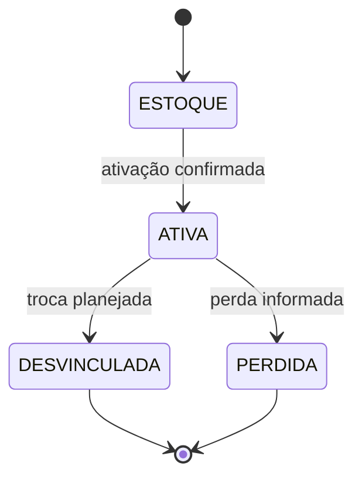
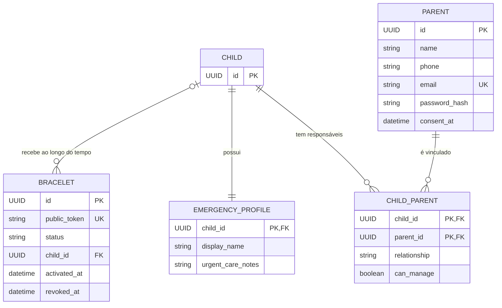
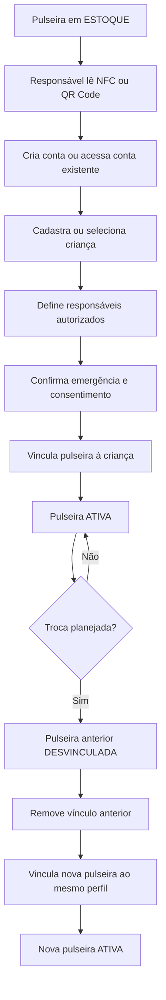
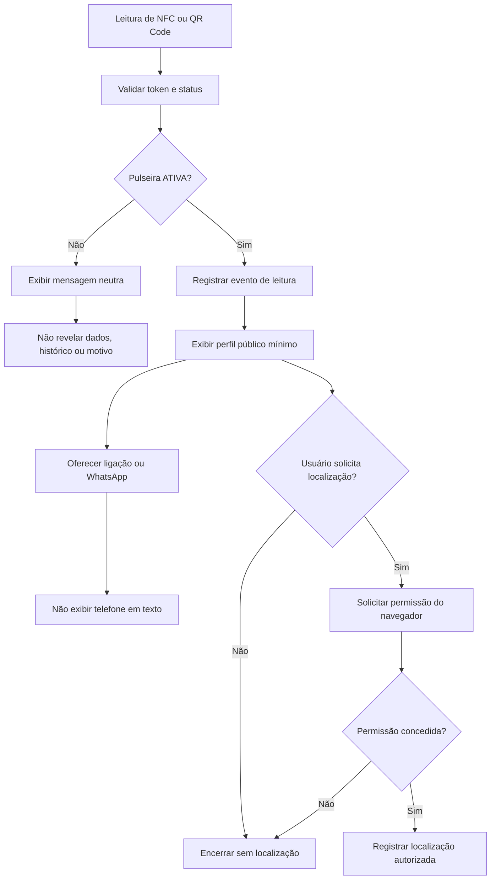
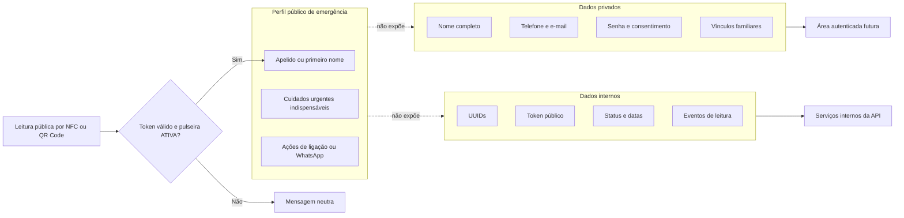

# Pertinho

Este documento é a fonte de verdade do produto, da arquitetura, das decisões
aprovadas e do estado atual do projeto Pertinho. Ele só deve ser atualizado
quando uma decisão de produto ou arquitetura for explicitamente aprovada.

O Pertinho é um sistema de identificação infantil por pulseira NFC e QR Code.
Seu objetivo é ajudar adultos a contatar responsáveis quando uma criança é
encontrada em locais como praias, parques, shoppings, eventos e aeroportos.

## Objetivo do MVP

- Oferecer uma pulseira física com uma URL única, legível por NFC ou QR Code.
- Permitir que os responsáveis atualizem o perfil associado sem trocar a
  pulseira.
- Exibir uma página pública de resgate rápida, mobile-first e limitada aos
  dados estritamente necessários.
- Oferecer contato direto por ligação ou WhatsApp sem exibir o telefone em
  texto.
- Adiar alertas, geolocalização e mensageria para fases posteriores.

## Princípios do produto

- O produto deve ter baixo custo; simplicidade prevalece sobre sofisticação.
- Cada criança pode ter somente uma pulseira ativa.
- Uma criança pode ter vários responsáveis autorizados.
- Tokens públicos são aleatórios, não enumeráveis, imutáveis e nunca
  reutilizados.
- Registros não são apagados fisicamente no MVP. Pulseiras antigas perdem o
  vínculo com a criança, e seus tokens deixam de retornar dados.
- Redis, Celery, pgAdmin, container da API, notificações reais e front-end
  complexo estão fora do escopo atual.

## Fluxos aprovados

### Ativação

1. A pulseira começa no estado `ESTOQUE`.
2. Um responsável lê o NFC ou QR Code.
3. O responsável cria uma conta ou acessa uma conta existente.
4. O responsável cadastra ou seleciona a criança e os responsáveis
   autorizados.
5. O responsável confirma os dados de emergência e o consentimento.
6. A pulseira é vinculada à criança e passa para `ATIVA`.

### Troca planejada

1. A pulseira ativa anterior passa para `DESVINCULADA`.
2. O vínculo da pulseira anterior com a criança é removido.
3. Uma nova pulseira é vinculada ao mesmo perfil.
4. A nova pulseira passa para `ATIVA`.

### Perda

1. A pulseira ativa passa para `PERDIDA`.
2. Seu vínculo com a criança é removido.
3. O token público deixa de fornecer dados.
4. Uma nova pulseira poderá ser vinculada futuramente ao mesmo perfil.

### Resgate

1. Um adulto lê o NFC ou QR Code.
2. A API valida o token público e o estado da pulseira.
3. Se a pulseira estiver `ATIVA`, o sistema registra o evento e exibe somente
   o perfil público mínimo de emergência.
4. A página oferece ações de ligação ou WhatsApp sem mostrar o número em texto.
5. A localização só pode ser solicitada mediante ação explícita e permissão do
   navegador.
6. Se a pulseira não estiver ativa, a página exibe uma mensagem neutra, sem
   revelar dados, histórico ou motivo da indisponibilidade.

## Estados de Bracelet

- `ESTOQUE` pode transicionar para `ATIVA`.
- `ATIVA` pode transicionar para `DESVINCULADA` ou `PERDIDA`.
- `DESVINCULADA` e `PERDIDA` são estados finais no MVP.



## Modelo de dados conceitual

### Bracelet

- `id`: UUID interno.
- `public_token`: token público único, aleatório e não enumerável.
- `status`: `ESTOQUE`, `ATIVA`, `DESVINCULADA` ou `PERDIDA`.
- `child_id`: UUID opcional da criança vinculada.
- `activated_at`: data e hora da ativação.
- `revoked_at`: data e hora da desvinculação ou perda.

### Child

- `id`: UUID interno.
- Dados privados mínimos do perfil infantil, definidos apenas quando a tarefa
  de modelagem física for aprovada.

### EmergencyProfile

- Relação 1:1 com `Child`.
- `display_name`: apelido ou primeiro nome autorizado para exibição pública.
- `urgent_care_notes`: cuidados urgentes estritamente necessários e
  autorizados.

### Parent

- `id`: UUID interno.
- `name`: nome privado do responsável.
- `phone`: telefone privado.
- `email`: e-mail privado e único.
- `password_hash`: hash de senha, implementado somente na fase de autenticação.
- `consent_at`: data e hora do consentimento.

### ChildParent

- Tabela de vínculo entre `Child` e `Parent`.
- `relationship`: relação do responsável com a criança.
- `can_manage`: permissão para gerenciar o perfil.

### ERD conceitual



## Integridade de dados

- `Bracelet.public_token` é único, imutável e jamais reutilizado.
- `Bracelet.child_id` é único enquanto houver vínculo. Ao desvincular ou marcar
  uma pulseira como perdida, `child_id` fica nulo.
- A unicidade de `child_id` vinculado garante no máximo uma pulseira ativa por
  criança no modelo aprovado.
- `ChildParent` possui chave composta única por `child_id` e `parent_id`.
- `Parent.email` é único.
- A rota pública aceita somente pulseiras com estado `ATIVA`.
- Índices iniciais: `Bracelet.public_token`, `Bracelet.child_id`,
  `Parent.email`, `ChildParent.child_id` e `ChildParent.parent_id`.

## Diagramas dos fluxos

### Ativação e troca planejada



### Resgate



## LGPD e dados de menores

- Aplicar minimização de dados em todas as fases.
- Separar o perfil público dos dados privados e dos dados internos do sistema.
- Exibir publicamente apenas apelido ou primeiro nome, cuidados urgentes
  indispensáveis e ações de contato.
- Manter privados nome completo, telefone, e-mail, senha, vínculos familiares
  e consentimento.
- Nunca expor publicamente endereço, escola, documentos, telefone em texto,
  e-mail ou nome completo.
- Informações de saúde são dados sensíveis. Registrar somente o indispensável
  para segurança imediata, com autorização e possibilidade de revisão pelo
  responsável.
- Geolocalização é opcional e exige ação explícita e consentimento de quem
  realizou a leitura.

### Separação de dados



## Stack aprovada

- Python >= 3.12 e Poetry.
- FastAPI, Uvicorn e pydantic-settings.
- PostgreSQL, SQLAlchemy assíncrono, asyncpg e Alembic.
- PyJWT e pwdlib com Argon2 somente no módulo posterior de autenticação.
- pytest, pytest-asyncio, httpx e Ruff.
- Jinja2, HTMX e Tailwind somente na Fase 4, quando aprovados.
- Redis e Celery somente se uma necessidade futura justificar sua adoção.

## Infraestrutura local atual

- Docker Compose com um único serviço `postgres`.
- Imagem `postgres:17-alpine`.
- Banco acessível somente em `127.0.0.1:5433`.
- Volume nomeado lógico `postgres_data`.
- Healthcheck com `pg_isready`.
- API executada pelo Poetry no WSL, sem container.
- PostgreSQL local do Docker confirmado como saudável.
- `DATABASE_URL` local configurada somente no `.env` ignorado pelo Git, no
  formato:

```text
postgresql+asyncpg://<usuario>:<senha>@127.0.0.1:5433/<banco>
```

## Roadmap

1. **Arquitetura e modelagem:** conceitualmente concluída e aprovada.
2. **Ambiente e core API:** em andamento.
3. **Motor de emergência e integrações:** não iniciado.
4. **Interface pública mobile-first:** não iniciada.
5. **Produção, segurança, testes e deploy:** não iniciada.

## Estado atual implementado

- `GET /health` concluído e testado.
- `Settings` implementada com `APP_ENV` obrigatório, limitado a `development`,
  `test` ou `production`, `APP_NAME` configurável e `DATABASE_URL` obrigatória.
- `.env.example` e `.gitignore` criados.
- Docker Compose com PostgreSQL saudável.
- `AsyncEngine` e `async_sessionmaker` compartilhados implementados em
  `app/database.py`.
- Dependência assíncrona `get_session` implementada com fechamento automático
  da sessão.
- Conectividade real validada com `SELECT 1` pelo engine e pela sessão.
- Base declarativa compartilhada usada pelos modelos físicos aprovados.
- Alembic configurado para usar conexão assíncrona e `DATABASE_URL` via
  `Settings`.
- Revisão inicial vazia `0001` aplicada ao PostgreSQL local.
- Modelo físico `Child` criado somente com `id: UUID`, sem dados pessoais ou
  timestamps.
- Migration `0002` cria exclusivamente a tabela `children` e suporta downgrade
  para `0001`.
- Modelo físico `Bracelet` criado com UUID, token público aleatório, os quatro
  estados aprovados, vínculo opcional e unidirecional com `Child` e datas de
  ativação/revogação.
- Migration `0003` cria `bracelets` com constraints de status, coerência de
  estado, unicidade e chave estrangeira, e suporta downgrade para `0002` sem
  alterar `children`.
- Defaults e constraints de `Bracelet` validados no PostgreSQL local por testes
  de integração condicionados a `TEST_DATABASE_URL`.
- Transições de domínio `ESTOQUE → ATIVA`, `ATIVA → DESVINCULADA` e
  `ATIVA → PERDIDA` implementadas na entidade `Bracelet`, com validação de
  estado, fuso horário, ordem temporal e atomicidade em memória.
- Exceções tipadas de transição e instante inválido não expõem identificadores
  nem dados pessoais.

### Comandos de migrations

```bash
poetry run alembic upgrade head
poetry run alembic current
```

### Verificação atual

`Settings` ignora variáveis extras do `.env` compartilhado com o Docker
Compose. Assim, `POSTGRES_DB`, `POSTGRES_USER` e `POSTGRES_PASSWORD` podem ser
usadas pela infraestrutura local sem serem campos da configuração da API. A
suíte volta a ser coletada e executada integralmente.

## Próximo recorte

As transições de domínio de `Bracelet` estão concluídas. A camada de aplicação
que controlará sessão, transação e tratamento de concorrência ainda não foi
implementada. Qualquer serviço, endpoint, schema ou nova entidade exige novo
recorte técnico aprovado.
